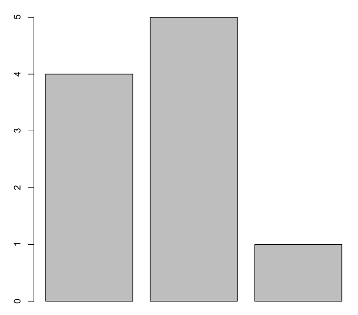
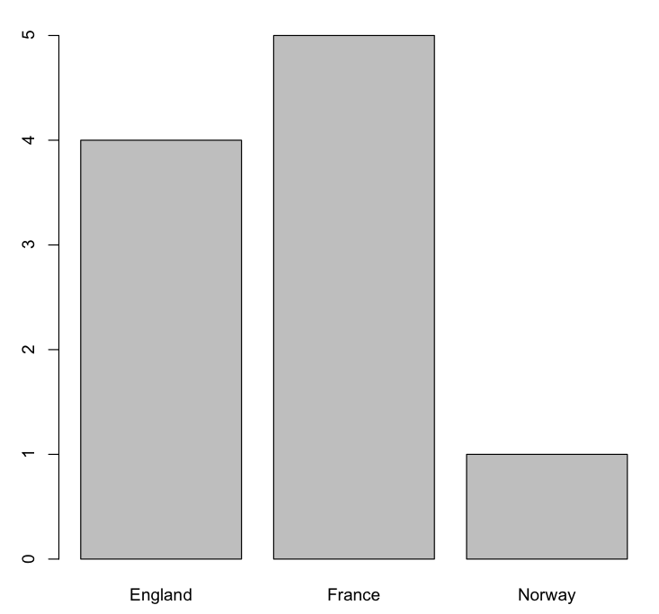
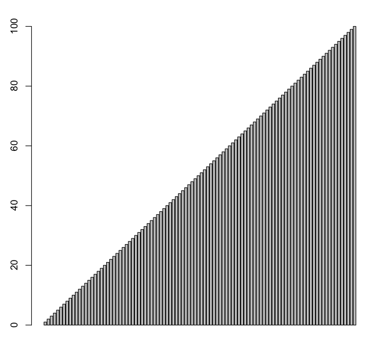

# R Language

R is a free software programming language and a software environment for statistical computing and graphics.

## Reference

* [Try R on CodeSchool](http://tryr.codeschool.com/)

## Install on Mac with home-brew

```
$ brew install gfortran R
```

## Basic

```
> T == TRUE
[1] TRUE

> x <- T
[1] TRUE

> sum(1,3,5)
[1] 9

> rep("Yo ho!",­ times­ = 3)
[1] "Yo ho!" "Yo ho!" "Yo ho!"

> help(sum)
> example(min)
> list.files() // list the files in the current directory
```

## Run script

```
> source("bottle1.R") // Run "bottle1.R" script
```

## Vectors 

( c is short for Combine ) creates a new vector by combining a list of values.

```
> c(4, 7, 9)
```

Vectors cannot hold values with different modes (types). All the values were converted to a single mode (characters) so that the vector can hold them all.

```
> c(1, T, "Three")
[1] "1" "TRUE" "Three"
```

### Sequence Vectors

```
> 5:9
[1] 5 6 7 8 9

> seq(5, 9)
[1] 5 6 7 8 9

> seq(5, 9, 0.5)
[1] 5.0 5.5 6.0 6.5 7.0 7.5 8.0 8.5 9.0

> sentence <- c('walk', 'the', 'plank')
> sentence[1] // R's vector indices start at 1.
[1] "walk"
> sentence[3] <- "dog"
> sentence[4] <- "to"
> sentence[5­:7] <- c('th­e', 'poop­', 'deck­')
> sentence[c(1,3)]
[1] "walk" "dog"

> sentence[2:4]
[1] "the" "dog" "to"
```

### Vetcor Names

**names** Functions to get or set the names of an object.

```
> ranks <- 1:3
> names(ranks) <- c("first", "second", "third")
> ranks
first second third
    1      2     3

> ranks[1]
first
    1

> ranks["first"]
first
    1

> ranks["third"] = 5
> ranks["third"]
third
    5
```

### Plotting One Vector

**barplot** function draws a bar chart with a vector's values.

```
> vesselsSunk <- c(4, 5, 1)
> barplot(vesselsSunk)
```


```
> names(vesselsSunk) <- c("England", "France", "Norway")
> barplot(vesselsSunk)
```


```
> barplot(1:100)
```



